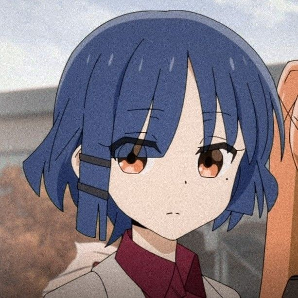

## GitHub Pages Home

This repository now includes a static homepage at [index.html](index.html) for GitHub Pages. It presents the same profile in a more polished, tech-forward layout.

  

<h1 align="center">Hi, I'm BYzhaoran (Wenzhao Wang) 👋</h1>

  
  
  

---

## 📊 Statistics & Contribution

  

<picture>
  <source media="(prefers-color-scheme: dark)" srcset="https://raw.githubusercontent.com/BYzhaoran/BYzhaoran/output/github-snake-dark.svg" />
  <source media="(prefers-color-scheme: light)" srcset="https://raw.githubusercontent.com/BYzhaoran/BYzhaoran/output/github-snake.svg" />
  
</picture>

---

  <a href="https://github.com/BYzhaoran">
    
    
    
    
     
    
    
    
    
  </a>

---

## 🔬 Research & Interest Areas

- <b>Embedded & Edge AI Systems</b>: Real-time inference & optimization.
- <b>Computer Vision</b>: Object Detection (DETR/YOLO) & Representation Learning.
- <b>Embodied Intelligence</b>: Multimodal interaction & Physical world grounding.
- <b>Robotics & Control</b>: From PID/SMC to advanced MPC & Trajectory planning.
- <b>Simulation & Middleware</b>: ROS2, Isaac Sim & Gazebo.

---

## 🛠️ Tech Stack

    
    
    

 

| Category | Tools & Technologies |
| :--- | :--- |
| **Microcontrollers** | STM32 (F4/H7), MSPM0G350x, ESP32, 51 |
| **Edge & Sensors** | Jetson Nano, Raspberry Pi 5, Orbbec Gemini2, ASR Pro |
| **AI Models** | Deformable DETR, YOLO Series, Whisper, DeepSeek-V2 |
| **Robotics** | ROS2, ROScpp, Isaac Sim, SO100 ARM, PID/SMC/LQR/MPC |
| **Languages** | Python, C, C++, Embedded C, MATLAB/Simulink |

---

## 🧩 Experience

### 🤖 RoboMaster Robotics Competition (RM)
- **Core Embedded Developer**: Focused on **real-time control systems** and **CAN-based communication**.
- Designed multi-actuator control pipelines and optimized PID loops for high-dynamic adversarial environments.
- Implemented fault diagnosis systems to ensure stability under strict real-time constraints.

### 🎓 AI + Education & Workflow
- **Smart Education**: Delivered workshops based on the **National Smart Education Platform** for primary schools.
- **AI-Assisted Dev**: Integrated **DeepSeek & Code Agents** into embedded development for faster debugging and system integration.

---

## 🚀 Highlighted Projects

* **🧠 Visual Detection Pipeline**: End-to-end system based on VisDrone & Deformable DETR.
* **🦾 SO100 Robotic Arm**: Trajectory planning, inverse kinematics, and multi-joint feedback.
* **❄️ AI Voice Smart Fridge**: Multimodal system (YOLO + Whisper + TTS + LLM).
* **📐 Control Algorithm Suite**: Validated SMC, ADRC, LQR, and MPC in Simulink & Embedded C.
* **🌐 Depth Camera Integration**: Adapted Orbbec Gemini2 for ROS-based Embodied AI frameworks.

---

## 🎯 Goals
- 📚 Deepen exploration in **real-time embodied AI systems**.
- 🔬 Bridge **classical control theory** and **learning-based methods**.
- 🤖 Advance expertise in **large-scale ROS2 robotic architectures**.

---

## 📫 Contact Me

  
  

  

